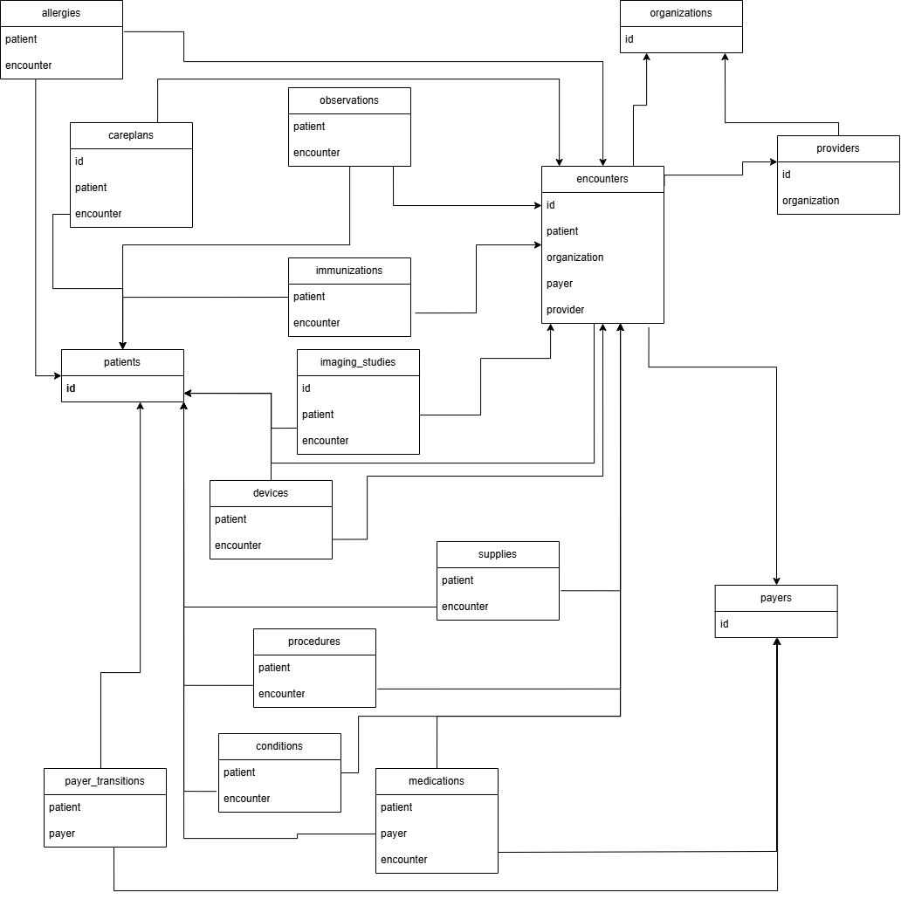
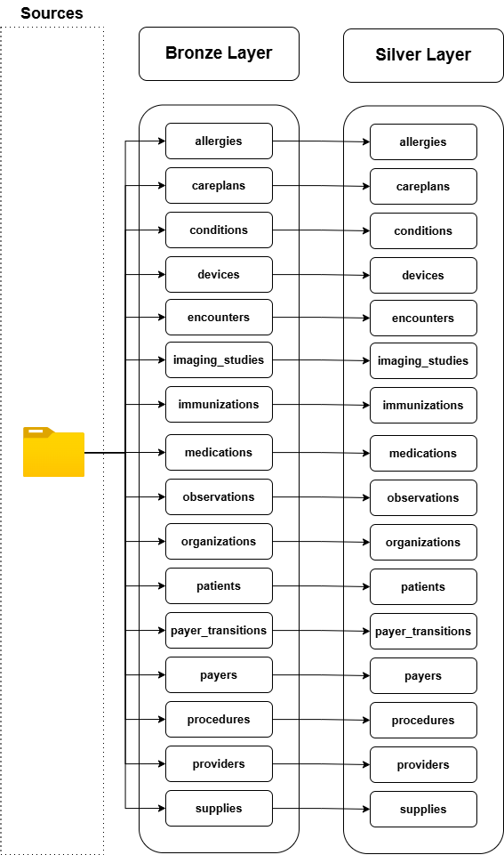
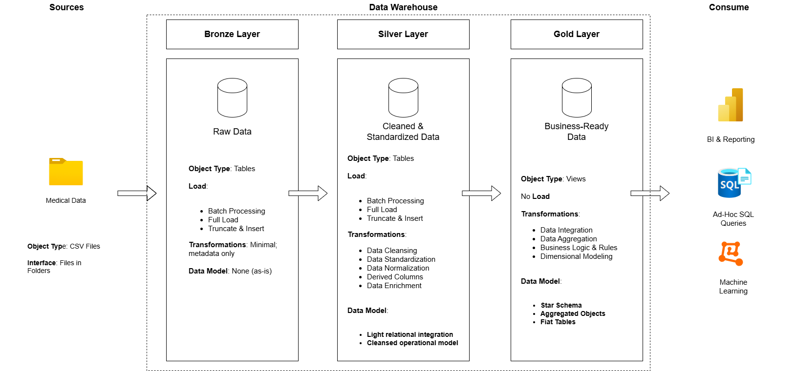

# 🏥 Clinical Data Warehouse (Synthea Synthetic Patient Records)

Welcome to the **Clinical Data Warehouse** repository!
This project demonstrates the design and implementation of a modern **clinical / EHR-style data warehouse** built on **synthetic healthcare data generated by Synthea**.
Designed as a portfolio and learning project, it highlights best practices in **data engineering**, **SQL development**, **ETL/ELT pipelines**, and **dimensional modeling**.

> **Status:** 🔄 In Progress — SQL Warehouse complete, Power BI dashboard in development

---

## 🏗️ Data Architecture

The data architecture follows the **Medallion Architecture** with **Bronze**, **Silver**, and **Gold** layers.



| Layer | Purpose | Object Type | Load Strategy | Data Model |
|---|---|---|---|---|
| 🥉 Bronze | Store raw source data | Tables | Full Load | None (as-is) |
| 🥈 Silver | Clean, standardize, validate and integrate | Tables | Full Refresh | Cleansed operational model |
| 🥇 Gold | Provide business-ready analytical data | Fact tables, Dimension tables, Views | Full Refresh | Star schema |

---

## 📊 Key Findings

The following insights were derived from the analytical queries built on top of the Gold layer:

- **Most prevalent condition:** Viral sinusitis dominates total diagnosis counts across all months with no seasonal pattern, suggesting it is endemic in this patient population year-round
- **Chronic conditions:** Obesity, prediabetes and hypertension show fewer total diagnoses but significantly higher active case rates, reflecting their persistent nature
- **Highest mortality rate:** Chronic congestive heart failure leads with an ~89.47% mortality rate among patients with that diagnosis, followed by suspected lung cancer (~86.66%)
- **Most visited organization:** VA Boston Healthcare System Jamaica Plain Campus with **[X] visits** generating **$[X] in total revenue** — *[fill in when home]*
- **Busiest provider:** Gaynell Streich with **3,983 encounters**, averaging **108 visits per unique patient** — indicating a small cohort of high-utilizer chronic patients
- **Monthly activity:** Encounter counts peak in summer months (May–July) and dip in February — *[confirm when home]*
- **Payer coverage:** *[Add insight from payer cost query when home]*

---

## 🗺️ Silver Layer — Entity Relationship Diagram

The Silver layer ERD shows all 16 tables with their key relationships. Encounters is the central hub table — nearly all clinical event tables link to it via foreign keys.



---

## 🔄 Data Flow

All 16 source CSV files flow from source through Bronze into Silver, where cleaning and standardization is applied before Gold layer modeling.



---

## 📖 Project Overview

This project involves:

- **Data Architecture:** Designing a clinical data warehouse using Medallion Architecture
- **ETL / ELT Pipelines:** Extracting, transforming, and loading synthetic clinical data into SQL Server
- **Data Modeling:** Developing fact and dimension tables optimized for analytical queries
- **Data Quality:** Testing and validating all 16 Silver tables and all Gold layer tables
- **Analytics & Reporting:** SQL-based reporting views and analytical queries
- **Documentation:** Data catalog, ERD, naming conventions, and architecture diagrams

---

## 🧪 Dataset

This project uses the **Synthea 1K Sample Synthetic Patient Records (CSV)** dataset — an open-source synthetic patient generator that produces realistic but not real healthcare records.

**Source:** [https://synthea.mitre.org/downloads](https://synthea.mitre.org/downloads)

The dataset simulates an **Electronic Health Record (EHR)** environment across 16 CSV files:

`patients` · `encounters` · `conditions` · `observations` · `medications` · `procedures` · `allergies` · `careplans` · `devices` · `imaging_studies` · `immunizations` · `organizations` · `providers` · `payers` · `payer_transitions` · `supplies`

---

## 🧠 Data Modeling

The Gold layer is modeled as a **star schema** with 5 dimension tables and 5 fact tables.

### Dimension Tables

| Table | Description | Source |
|---|---|---|
| `dim_patient` | Patient demographics, age, deceased flag | silver.patients |
| `dim_provider` | Provider details + organization attributes (denormalized) | silver.providers + silver.organizations |
| `dim_organization` | Healthcare organization details | silver.organizations |
| `dim_payer` | Insurance payer details and coverage metrics | silver.payers |
| `dim_date` | Calendar dimension (1900–2100) for time-based analysis | Generated |

### Fact Tables

| Table | Grain | Key Measures |
|---|---|---|
| `fact_encounter` | One row per clinical encounter | base_encounter_cost, total_claim_cost, payer_coverage |
| `fact_condition` | One row per condition per patient | is_active flag, start/end dates |
| `fact_observation` | One row per clinical observation | value, units, type |
| `fact_medication` | One row per prescription | base_cost, payer_coverage, dispenses, totalcost |
| `fact_procedure` | One row per procedure performed | base_cost |

### Reporting Views

| View | Description |
|---|---|
| `vw_patient_summary` | Patient demographics with encounter and condition counts |
| `vw_encounter_details` | Encounters with patient, provider, organization and payer joined |
| `vw_condition_prevalence` | Condition diagnosis counts, active vs resolved cases |
| `vw_monthly_encounter_activity` | Encounter volume and costs by month and year |

---

## 🔍 Silver Layer Transformations

Key transformations applied during the Bronze → Silver load:

- **Data type casting** — all dates cast from NVARCHAR to DATE/DATETIME using TRY_CAST/TRY_CONVERT
- **NULL handling** — stop dates preserved as NULL (active records), unexpected NULLs flagged in tests
- **Deduplication** — ROW_NUMBER() applied to medications and observations to remove source duplicates
- **String standardization** — TRIM() applied to all NVARCHAR columns, LOWER() applied to encounterclass
- **Name cleaning** — numeric suffixes removed from patient and provider names (Synthea generation artifact) using TRANSLATE/REPLACE
- **Date correction** — birthdates and deathdates corrected for century misinterpretation from 2-digit year format
- **Value capping** — qols_avg capped to [0,1] range (NO_INSURANCE payer produces values slightly above 1 in Synthea)
- **FK column renaming** — patient → patient_id, encounter → encounter_id etc. for explicit relationship naming

---

## 🏆 Gold Layer Transformations

Key transformations applied during the Silver → Gold load:

- **Surrogate key generation** — INT IDENTITY(1,1) surrogate keys on all dimensions
- **Denormalization** — provider dimension includes organization attributes (name, city, state) to avoid analyst joins
- **Derived columns** — age calculated at deathdate for deceased patients, full_name concatenated, is_deceased/is_active flags
- **Business logic standardization** — gender and marital status values standardized (M/F → male/female, M/S → married/single)
- **Date dimension generation** — 73,414 rows generated from 1900-01-01 to 2100-12-31 via recursive CTE

---

## ⚙️ Naming Conventions

| Convention | Pattern | Example |
|---|---|---|
| General | snake_case, English | patient_id, encounter_key |
| Source identifiers | `_id` suffix | patient_id, encounter_id |
| Surrogate keys | `_key` suffix | patient_key, date_key |
| Technical columns | `dwh_` prefix | dwh_create_date |
| Dimensions | `dim_` prefix | dim_patient, dim_date |
| Facts | `fact_` prefix | fact_encounter, fact_condition |
| Views | `vw_` prefix | vw_patient_summary |

---

## 🔄 Load Strategy

Full-load approach throughout — appropriate for a dataset snapshot:

```sql
-- Run in order
EXEC bronze.load_bronze;   -- Load raw CSVs into Bronze
EXEC silver.load_silver;   -- Clean and standardize into Silver
EXEC gold.load_gold;       -- Build dimensional model in Gold
```

---

## 🧪 Data Quality Testing

Comprehensive test suites are included for all three layers:

- **`tests/test_bronze.sql`** — Row count validation and source data profiling to inform Silver transformations
- **`tests/test_silver.sql`** — NULL checks, duplicate checks, FK orphan checks, date validation, domain validation and financial checks across all 16 tables
- **`tests/test_gold.sql`** — Surrogate key integrity, duplicate natural key checks, referential integrity, business logic flag validation and cost checks

---

## 📂 Repository Structure

```
clinical-data-warehouse/
│
├── datasets/                           # Placeholder — CSV files not included due to size
│                                       # Download from: https://synthea.mitre.org/downloads
│
├── docs/                               # Project documentation and architecture diagrams
│   ├── data_catalog.md                 # Silver layer data catalog (all 16 tables)
│   └── images/
│       ├── architecture.png            # Full Medallion Architecture diagram
│       ├── data_flow.png               # Bronze to Silver data flow diagram
│       └── silver_erd.png              # Silver layer ERD (keys only)
│
├── scripts/                            # SQL scripts
│   ├── init_database.sql               # Database and schema creation
│   ├── bronze/
│   │   ├── ddl_bronze.sql              # Bronze table definitions
│   │   └── proc_load_bronze.sql        # Bronze stored procedure
│   ├── silver/
│   │   ├── ddl_silver.sql              # Silver table definitions
│   │   └── proc_load_silver.sql        # Silver stored procedure
│   ├── gold/
│   │   ├── ddl_gold.sql                # Gold table definitions
│   │   ├── proc_load_gold.sql          # Gold stored procedure
│   │   ├── views/                      # Reporting views
│   │   └── analytical_queries/         # Analytical SQL queries with insights
│   │       ├── 01_top_conditions_by_diagnosis.sql
│   │       ├── 02_monthly_encounters_top_condition.sql
│   │       ├── 03_mortality_by_condition.sql
│   │       ├── 04_most_visited_organizations.sql
│   │       └── 05_provider_activity.sql
│
├── tests/
│   ├── test_bronze.sql                 # Bronze layer tests
│   ├── test_silver.sql                 # Silver layer tests
│   └── test_gold.sql                   # Gold layer tests
│
├── README.md
├── LICENSE                             # MIT license
└── .gitignore
```

---

## 🛠️ Tools and Technologies

| Tool | Purpose |
|---|---|
| SQL Server | Database and warehouse engine |
| SSMS | SQL development environment |
| Draw.io | Architecture and ERD diagrams |
| GitHub | Version control and portfolio |
| Power BI | Dashboard and visualization *(in progress)* |

---

## 👤 Author

**Dušan Devedžić**
Master's student in Information Technology (ML Engineering & Data Science focus)
Aspiring Data Engineer

[GitHub](https://github.com/Ddevedza) · [LinkedIn](https://linkedin.com/in/dusan-devedzic-3812031b2)
